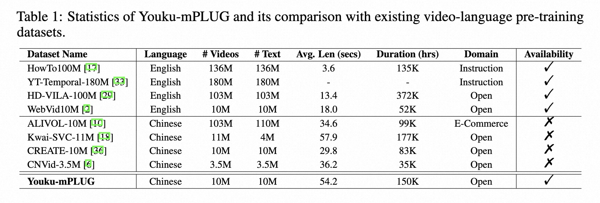
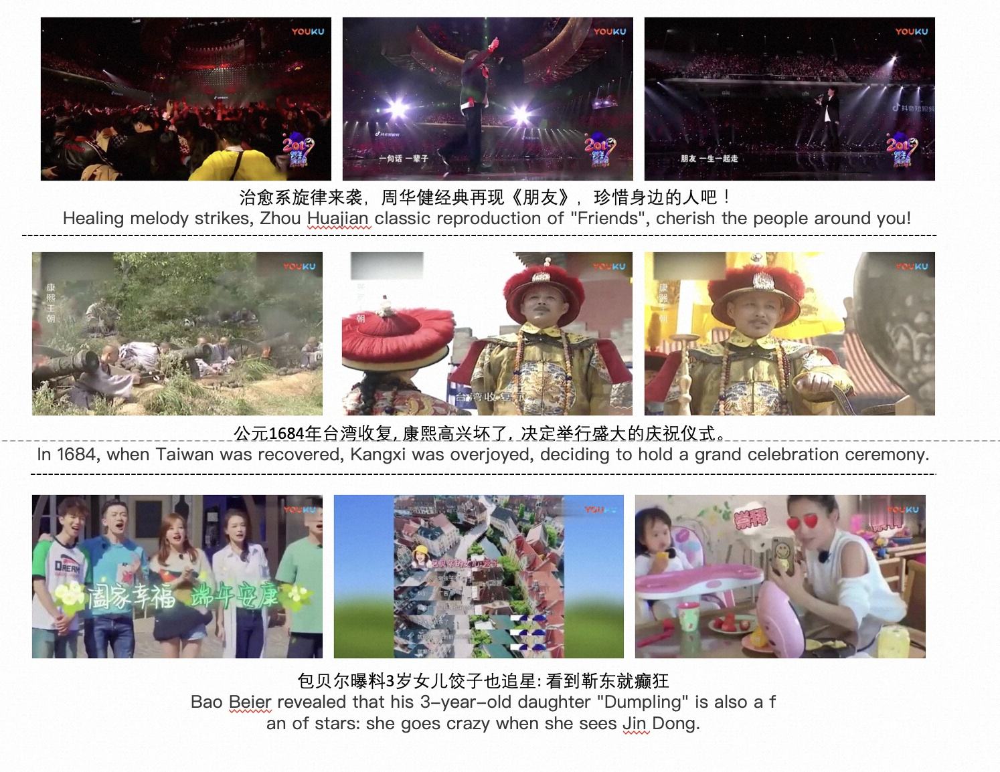
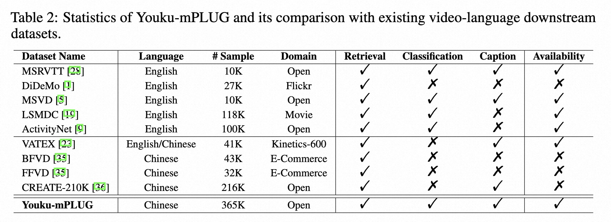
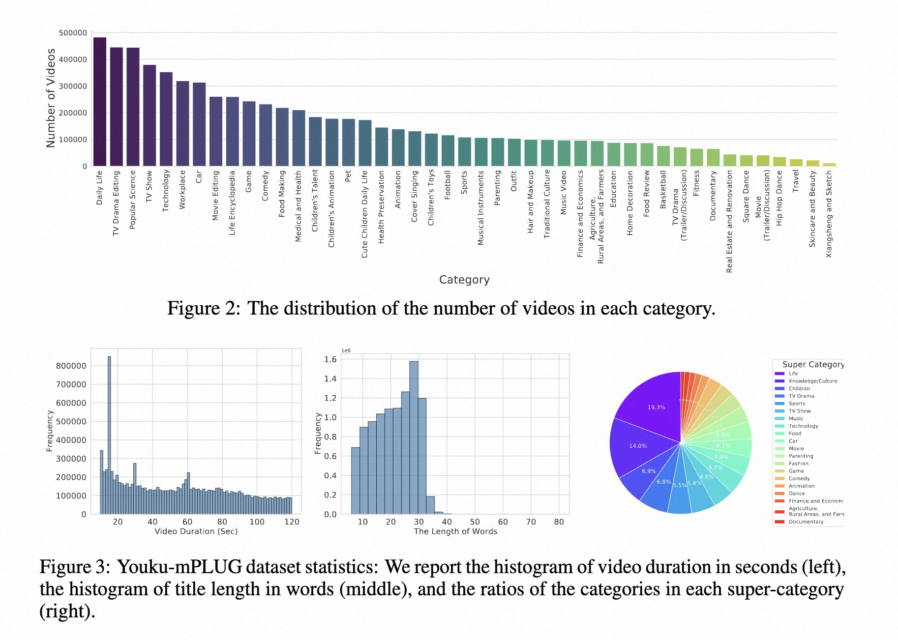
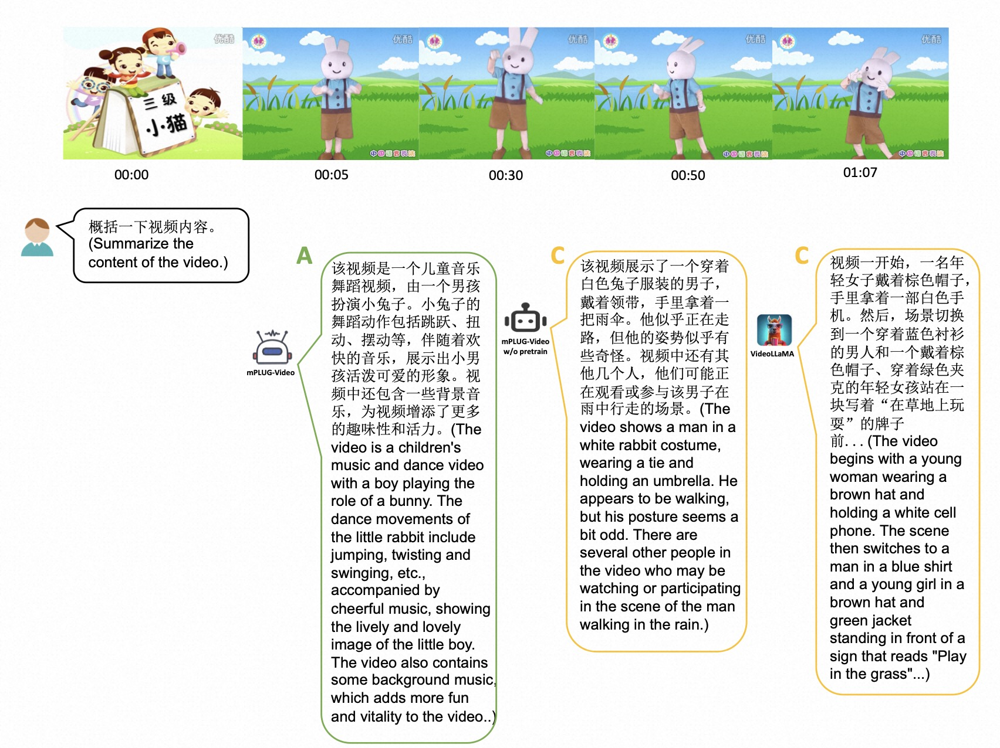
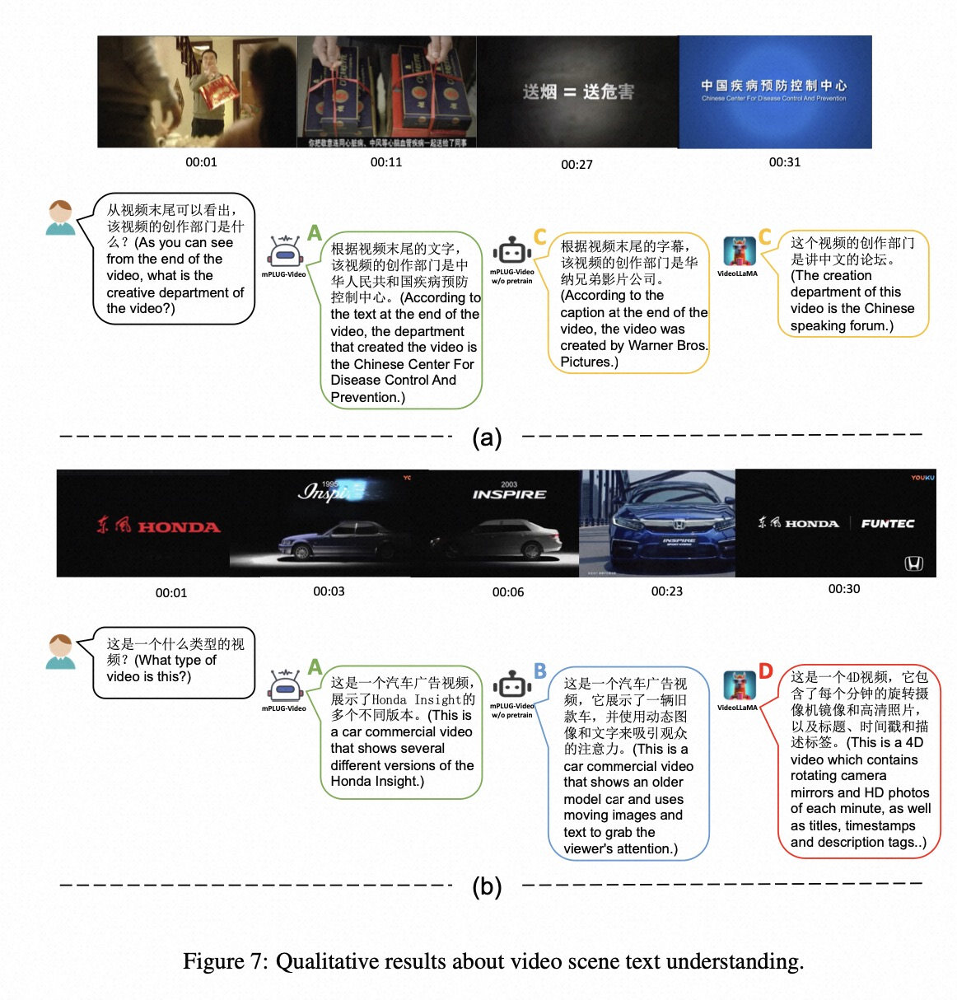

# Youku-mPLUG 10M Chinese Large-Scale Video Text Dataset
Youku-mPLUG: A 10 Million Large-scale Chinese Video-Language Pre-training Dataset and Benchmarks
[Download Link HERE](https://modelscope.cn/datasets/modelscope/Youku-AliceMind/summary)

[Paper](https://arxiv.org/abs/2306.04362)

<p align="center">

</p>

## What is Youku-mPLUG?
We release the public largest Chinese high-quality video-language dataset (10 million) named **Youku-mPLUG**, which is collected 
from a well-known Chinese video-sharing website, named Youku, with strict criteria of safety, diversity, and quality.

<p align="center">

</p>
<p align="center">

</p>
<p align="center">
<font size=2 color="gray">Examples of video clips and titles in the proposed Youku-mPLUG dataset.</font>
</p>

We provide 3 different downstream multimodal video benchmark datasets to measure the capabilities of pre-trained models. The 3 different tasks include:
- Video Category Prediction：Given a video and its corresponding title, predict the category of the video.
- Video-Text Retrieval：In the presence of some videos and some texts, use video for text retrieval and text for video retrieval.
- Video Captioning：In the presence of a video, describe the content of the video.
<p align="center">

</p>


## Data statistics
The dataset contains 10 million videos in total, which are of high quality and distributed in 20 super categories can 45 categories.

<p align="center">

</p>
<p align="center">
<font size=2 color="gray">The distribution of categories in Youku-mPLUG dataset.</font>
</p>

## Zero-shot Capability

<p align="center">


</p>


## Download
You can download all the videos through this [link](https://modelscope.cn/datasets/modelscope/Youku-AliceMind/summary) 

## mPLUG-Video (1.3B / 2.7B)
### Pre-train
First you should download GPT-3 1.3B & 2.7B checkpoint from [Modelscope](https://www.modelscope.cn/models/damo/nlp_gpt3_text-generation_1.3B/summary). The pre-trained model can be downloaded [Here (1.3B)](http://mm-chatgpt.oss-cn-zhangjiakou.aliyuncs.com/1_3B_mp_rank_00_model_states.pt) and [Here (2.7B)](http://mm-chatgpt.oss-cn-zhangjiakou.aliyuncs.com/2_7B_mp_rank_00_model_states.pt).

Running the pre-training of mPLUG-Video as:
```python
exp_name='pretrain/gpt3_1.3B/pretrain_gpt3_freezeGPT_youku_v0'
PYTHONPATH=$PYTHONPATH:./ \
python -m torch.distributed.launch --nproc_per_node=8 --master_addr=$MASTER_ADDR \
  --master_port=$MASTER_PORT \
  --nnodes=$WORLD_SIZE \
  --node_rank=$RANK \
  --use_env run_pretrain_distributed_gpt3.py \
  --config ./configs/${exp_name}.yaml \
  --output_dir ./output/${exp_name} \
  --enable_deepspeed \
  --bf16
  2>&1 | tee ./output/${exp_name}/train.log
```

### Benchmarking
To perform downstream fine-tuning. We take Video Category Prediction as an example:
```python
exp_name='cls/cls_gpt3_1.3B_youku_v0_sharp_2'
PYTHONPATH=$PYTHONPATH:./ \
python -m torch.distributed.launch --nproc_per_node=8 --master_addr=$MASTER_ADDR \
  --master_port=$MASTER_PORT \
  --nnodes=$WORLD_SIZE \
  --node_rank=$RANK \
  --use_env downstream/run_cls_distributed_gpt3.py \
  --config ./configs/${exp_name}.yaml \
  --output_dir ./output/${exp_name} \
  --enable_deepspeed \
  --resume output/gpt3_1.3B/pretrain_gpt3_freezeGPT_youku_v0/checkpoint-9/mp_rank_00_model_states.pt \
  --evaluate_only \
  --bf16
  2>&1 | tee ./output/${exp_name}/train.log
```

## mPLUG-Video (BloomZ-7B)
We build the mPLUG-Video model based on [mPLUG-Owl](https://github.com/X-PLUG/mPLUG-Owl). To use the model, you should first clone the mPLUG-Owl repo as 
```bash
git clone https://github.com/X-PLUG/mPLUG-Owl.git
cd mPLUG-Owl/mPLUG-Owl
```
The instruction-tuned checkpoint is available on [HuggingFace](https://huggingface.co/MAGAer13/mplug-youku-bloomz-7b). For finetuning the model, you can refer to [mPLUG-Owl Repo](https://github.com/X-PLUG/mPLUG-Owl). To perform video inference you can use the following code:
```python
import torch
from mplug_owl_video.modeling_mplug_owl import MplugOwlForConditionalGeneration
from transformers import AutoTokenizer
from mplug_owl_video.processing_mplug_owl import MplugOwlImageProcessor, MplugOwlProcessor

pretrained_ckpt = 'MAGAer13/mplug-youku-bloomz-7b'
model = MplugOwlForConditionalGeneration.from_pretrained(
    pretrained_ckpt,
    torch_dtype=torch.bfloat16,
    device_map={'': 0},
)
image_processor = MplugOwlImageProcessor.from_pretrained(pretrained_ckpt)
tokenizer = AutoTokenizer.from_pretrained(pretrained_ckpt)
processor = MplugOwlProcessor(image_processor, tokenizer)

# We use a human/AI template to organize the context as a multi-turn conversation.
# <|video|> denotes an video placehold.
prompts = [
'''The following is a conversation between a curious human and AI assistant. The assistant gives helpful, detailed, and polite answers to the user's questions.
Human: <|video|>
Human: 视频中的女人在干什么？
AI: ''']

video_list = ['yoga.mp4']

# generate kwargs (the same in transformers) can be passed in the do_generate()
generate_kwargs = {
    'do_sample': True,
    'top_k': 5,
    'max_length': 512
}
inputs = processor(text=prompts, videos=video_list, num_frames=4, return_tensors='pt')
inputs = {k: v.bfloat16() if v.dtype == torch.float else v for k, v in inputs.items()}
inputs = {k: v.to(model.device) for k, v in inputs.items()}
with torch.no_grad():
    res = model.generate(**inputs, **generate_kwargs)
sentence = tokenizer.decode(res.tolist()[0], skip_special_tokens=True)
print(sentence)
```

## Citing Youku-mPLUG

If you find this dataset useful for your research, please consider citing our paper.

```bibtex
@misc{xu2023youku_mplug,
    title={Youku-mPLUG: A 10 Million Large-scale Chinese Video-Language Dataset for Pre-training and Benchmarks},
    author={Haiyang Xu, Qinghao Ye, Xuan Wu, Ming Yan, Yuan Miao, Jiabo Ye, Guohai Xu, Anwen Hu, Yaya Shi, Chenliang Li, Qi Qian, Que Maofei, Ji Zhang, Xiao Zeng, Fei Huang},
    year={2023},
    eprint={2306.04362},
    archivePrefix={arXiv},
    primaryClass={cs.CL}
}
```
